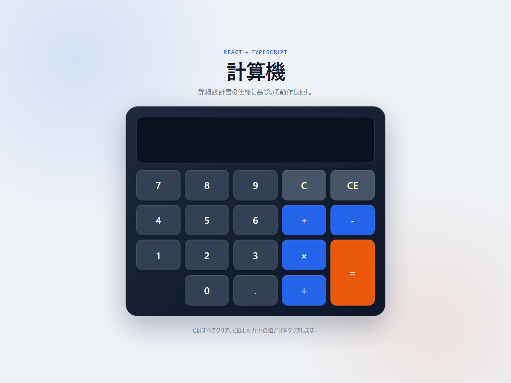

# テスト・最終検証記録

## 1. 検証結果

検証日：2026年9月28日

| 検証 | 結果 |
| --- | --- |
| `npm run typecheck` | 成功 |
| `npm run lint` | 成功 |
| `npm run test -- --maxWorkers=1` | 4ファイル、34件成功 |
| `npm run build` | 成功 |
| ローカル開発サーバー | HTTP 200 |
| ブラウザ描画 | Chromeヘッドレスで確認・画像保存 |

## 2. 要件とテストの対応

| 要件ID | 要件 | 主なテスト |
| --- | --- | --- |
| CALC-001 | 数字0～9 | 数字追加、UI全ボタン、UI加算 |
| CALC-002 | 小数点は1個まで | 小数点重複、空表示の小数点、UI小数計算 |
| CALC-003 | 四則演算 | 共通処理4演算、UI演算 |
| CALC-004 | 演算子の置換 | S2演算子置換、UI演算子置換 |
| CALC-005 | 左から順に連続演算 | reducerとUIの`2 + 3 × 4 = 20` |
| CALC-006 | `C`で両表示をクリア | reducer、UI操作 |
| CALC-007 | `CE`で計算2だけクリア | reducer、UI操作 |
| CALC-008 | 不足値・連続`=`は無操作 | S1・S2計算、UI連続`=` |
| CALC-009 | 0除算は`0` | 共通処理、reducer、UI操作 |
| CALC-010 | 小数点以下15桁・四捨五入 | 1÷3、2÷3、16桁目4・5、負数境界 |

## 3. テストファイル

| ファイル | 対象 |
| --- | --- |
| `src/logic/calculator.test.ts` | 数字、小数点、演算、Decimal、丸め、0除算 |
| `src/logic/calculatorReducer.test.ts` | S0～S3、連続演算、C、CE、連続`=` |
| `src/components/Calculator.test.tsx` | UI構造、全ボタン、型付きコールバック |
| `src/App.test.tsx` | reducerとUIを結合した実操作 |

## 4. 設計どおりの注意事項

- 初期表示は`0`ではなく空である。
- 空表示で小数点を押しても入力されない。
- 0除算はエラーではなく`0`になる。
- 計算結果後の数字は結果末尾へ追加される。
- `=`を繰り返しても前回演算を再実行しない。
- 乗除算優先ではなく左から順に計算する。
- 独自キーボードショートカットは追加していない。Tab、Enter、Spaceはbutton標準動作を利用する。

## 5. 未追加機能

詳細設計書にないため、以下は実装していない。

- パーセント
- 符号反転ボタン
- バックスペース
- 計算履歴
- メモリー機能
- 指数表記への自動切り替え
- 入力桁数の独自上限

## 6. 画面確認

- 実行中の確認先：<http://127.0.0.1:5173/>
- 保存画像：`document/ui-preview.png`

